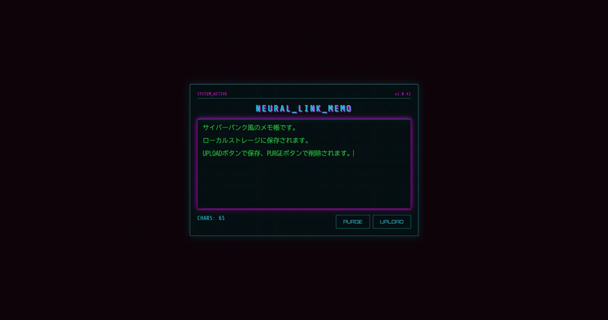

# Cyberpunk-Notepad

サイバーパンク風の UI で動くメモ帳。LocalStorage に保存するシングルページ Web アプリ。

## できること

- テキスト入力 → 「UPLOAD」で LocalStorage に保存
- リロード後も自動復元
- 「PURGE」で全削除
- タイピング音 / 保存音 / 削除音
- 保存時のグリッチ風の画面揺れ演出
- スキャンライン + ネオン配色のサイバーパンク世界観

## 技術スタック

HTML / CSS / Vanilla JavaScript（ビルドツール無し、`index.html` を直接開けば動く）

## メモ

WMS や EC を作る前の学習段階で、フレームワークに頼らず素の JS で
DOM 操作・LocalStorage・Audio 再生・CSS アニメーションを一通り
触っておくために作成した小品です。
